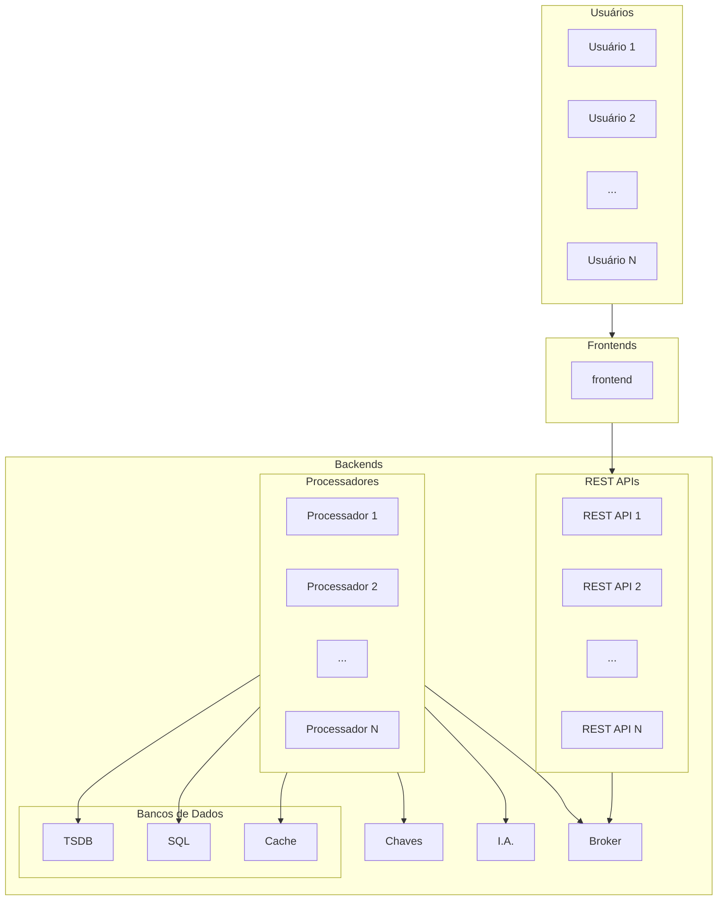
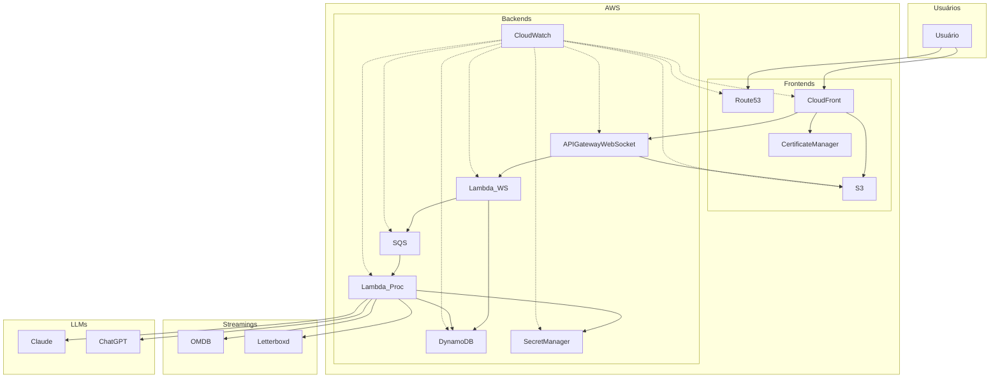

# ISN 2026.1

Projeto da disciplina ISN 75620501, edição 2026.1.

## Requisitos

São requisitos funcionais:

1. O sistema deve ter suporte a dispositivos móveis (Android e iOS) e computadores pessoais como *notebooks* e *tablets* (Windows, Linux e MacOS/iPadOS).
1. Permitir o cadastro de usuário por email e senha.
1. Prover autenticação via email e senha.
1. Permitir a troca de senha.
4. Permitir recuperação de senha por email.
1. Permitir a troca de email de cadastro, desde que ambos os emails sejam validados.
1. Prover autorização com RBAC para controle de acesso de classificação etária e perfil familiar aos serviços da solução.
1. Realizar log de todas as operações realizadas pelo usuário.
1. Permitir que o usuário peça um filme para assistir, o qual será entregue de forma aleatória de um banco de dados online.
1. Permitir que o usuário informe os serviços de *streaming* atualmente assinados para fazer um filtro dos possíveis filmes já sob demanda e para alugar ou comprar.
1. Permitir que o usuário personalize a sua experiência com base do seu histórico de uso.
1. Permitir que o usuário escolha o **humor do dia** para filtrar os possíveis filmes.
1. Permitir que os filmes sejam filtrados por faixa etária.
1. Permitir que uma sugestão possa entrar na fila para assistir depois.
1. Executar rotinas de qualidade antes de publicar a solução.
1. Automatizar integração e implantação de código (CI/CD).

São requisitos desejáveis, não obrigatórios:

1. Apresentar uma árvore de decisão com poucas perguntas (cerca de 3) para filtrar as opções de filmes.
1. Permitir integração com agenda para assistir depois.
1. Usar aprendizado de máquina para melhorar as sugestões de filme.
1. Usar recomendações de redes sociais, com base em quantidade de menções, para melhorar a oferta de filmes.
1. Integrar com Letterbox.

São requisitos não funcionais:

1. O sistema deve ter boa responsividade.
1. O sistema deve rodar sob baixa latência.
1. O sistema deve rodar sob custo mínimo, se for o caso multinuvem com *service mesh*.

## Diagrama de blocos

Com serviços de nome genérico:

Com serviços AWS:

